# ROSA OpenShift Virtualization — Architecture Diagrams

**Version**: 1.0  
**Date**: February 17, 2026  
**Purpose**: Lucidchart-ready Mermaid diagram and build specification

---

## 1. Mermaid Diagram

Paste the code block below into any Mermaid-compatible renderer (Lucidchart import, GitHub, mermaid.live, VS Code plugin) to generate the architecture diagram.

```mermaid
flowchart LR
  %% ───────────────────────────────────────────────
  %% LEGEND (render as a note or separate subgraph)
  %% ───────────────────────────────────────────────
  subgraph LEGEND [" Legend "]
    direction LR
    L1[ Solid line ── Data path]
    L2[ Dashed line ╌╌ Mgmt / Control]
    L3[ Dotted line ·· Monitoring / Logging]
  end

  %% ═══════════════════════════════════════════════
  %% ON-PREM
  %% ═══════════════════════════════════════════════
  subgraph ONPREM ["🏢 On-Premises Data Center — 10.63.0.0/16"]
    direction TB
    ADMIN["👤 Admin Workstation"]
    VCENTER["vCenter Server<br/>(Source of Truth)"]
    ESXI["ESXi Hosts<br/>(VMDK Disks)"]
    ONPREM_DNS["On-Prem DNS<br/>(corp.cusa.canon.com)"]
    ONPREM_NET["Corporate Network<br/>10.63 / 10.68 / 10.99<br/>10.110 / 10.140 / 10.158"]
    VCENTER --- ESXI
  end

  %% ═══════════════════════════════════════════════
  %% VPN / CONNECTIVITY
  %% ═══════════════════════════════════════════════
  subgraph VPN_ZONE ["🔒 Site-to-Site VPN Connectivity"]
    direction TB
    CGW["Customer Gateway<br/>(Certificate-Based)<br/>cgw-0f82cc789449111b7"]
    TGW["AWS Transit Gateway<br/>tgw-041316428b4c331d0"]
    VPN_CONN["S2S VPN Connection<br/>vpn-059ee0661e851adf4<br/>Tunnel 1: 3.232.27.186<br/>Tunnel 2: 98.94.136.2"]
    TGW_RT["TGW Route Table<br/>10.227.128.0/21 → VPN<br/>10.227.96.0/20 → VPC"]
    CGW -->|"IKEv2 / IPsec<br/>UDP 500, 4500"| VPN_CONN
    VPN_CONN --> TGW
    TGW --> TGW_RT
  end

  %% ═══════════════════════════════════════════════
  %% AWS VPC
  %% ═══════════════════════════════════════════════
  subgraph AWS_VPC ["☁️ AWS VPC — 10.227.96.0/20 (us-east-1)"]
    direction TB

    subgraph PUB_SUB ["Public Subnets"]
      direction LR
      NAT_GW["NAT Gateway"]
      IGW["Internet Gateway"]
      NLB["NLB<br/>(ROSA Ingress)"]
    end

    subgraph PRIV_SUB ["Private Subnets"]
      direction LR
      PRIV_A["AZ-a<br/>10.227.97.0/24"]
      PRIV_B["AZ-b<br/>10.227.98.0/24"]
      PRIV_C["AZ-c<br/>10.227.99.0/24"]
    end

    SG_NACL["Security Groups / NACLs<br/>• Worker SG: CUDN CIDR allowed<br/>• FSx SG: iSCSI 3260, NFS 2049<br/>• API SG: 443, 6443"]
    R53["Route 53<br/>*.openshiftapps.com<br/>(DNS Resolution)"]
    VPC_RT["VPC Route Tables<br/>0.0.0.0/0 → NAT GW<br/>10.227.128.0/21 → TGW<br/>10.63.0.0/16 → TGW"]
  end

  %% ═══════════════════════════════════════════════
  %% ROSA CLUSTER
  %% ═══════════════════════════════════════════════
  subgraph ROSA ["🔺 ROSA Cluster — non-prod.5wp0.p3.openshiftapps.com"]
    direction TB

    subgraph CTRL ["Control Plane (AWS-Managed)"]
      direction LR
      API["API Server<br/>(6443/tcp)"]
      ETCD["etcd"]
    end

    subgraph WORKERS ["Worker Nodes — m5.metal (Bare Metal)"]
      direction TB

      subgraph OPERATORS ["Platform Operators"]
        direction LR
        CNV["OpenShift Virtualization<br/>Operator<br/>(HyperConverged CR)"]
        MTV_OP["MTV Operator<br/>(Forklift Controller)"]
        GITOPS["OpenShift GitOps<br/>(Argo CD)"]
        ESO["External Secrets<br/>Operator"]
      end

      subgraph CUDN_NET ["CUDN Overlay — vm-network — 10.227.128.0/21 (IPAM off)"]
        direction LR
        IPSEC_A["ipsec-a VM<br/>Libreswan + Keepalived<br/>10.227.128.10<br/>VIP: 10.227.128.1"]
        IPSEC_B["ipsec-b VM<br/>Libreswan + Keepalived<br/>10.227.128.11<br/>(Standby)"]
        VM_WIN["Windows VMs<br/>nymsdv297, nymsdv301 ...<br/>10.227.128.20+"]
        VM_LIN["Linux VMs<br/>10.227.128.50+"]
      end

      subgraph VIRT_RUNTIME ["KubeVirt Runtime"]
        direction LR
        LAUNCHER["virt-launcher Pods<br/>(1 per running VM)"]
        HANDLER["virt-handler<br/>(DaemonSet)"]
        CDI["CDI Controller<br/>(Disk Import)"]
      end

      INGRESS["Ingress Controller<br/>(Router / NLB-backed)"]

      subgraph OBS ["Observability"]
        direction LR
        PROM["Prometheus<br/>+ Alertmanager"]
        GRAFANA["Grafana<br/>Dashboards"]
        LOKI["Loki<br/>(OpenShift Logging)"]
      end

      OADP["OADP / Velero<br/>(Backup to S3)"]
      CERTMGR["cert-manager"]
    end
  end

  %% ═══════════════════════════════════════════════
  %% STORAGE
  %% ═══════════════════════════════════════════════
  subgraph STORAGE ["💾 Storage — FSx for NetApp ONTAP"]
    direction TB
    FSX["FSx ONTAP<br/>fs-0ed7b12fbd51c89ae<br/>(Multi-AZ)"]
    SVM["SVM: svm-nonprod<br/>Mgmt LIF: 198.19.180.139<br/>iSCSI: 10.227.97.67,<br/>10.227.102.138"]
    TRIDENT["Trident CSI Driver<br/>(Namespace: trident)"]
    SC_SAN["StorageClass:<br/>ontap-san-economy<br/>(iSCSI Block, RWO)"]
    SC_NAS["StorageClass:<br/>trident-csi<br/>(NFS, RWO/RWX)"]
    PVC_VM["PVCs<br/>(VM Boot + Data Disks)"]
    FSX --- SVM
    SVM -->|"ONTAP API<br/>TCP 443"| TRIDENT
    TRIDENT --> SC_SAN
    TRIDENT --> SC_NAS
    SC_SAN --> PVC_VM
    SC_NAS --> PVC_VM
  end

  %% ═══════════════════════════════════════════════
  %% CONNECTIONS — Data Path (solid)
  %% ═══════════════════════════════════════════════
  ONPREM_NET ==>|"IKEv2/IPsec<br/>UDP 500/4500"| CGW
  TGW_RT ==> VPC_RT
  VPC_RT ==> PRIV_A
  VPC_RT ==> PRIV_B
  VPC_RT ==> PRIV_C

  IPSEC_A ==>|"ESP Tunnel<br/>(via NAT GW)"| VPN_CONN
  IPSEC_B -.->|"Standby<br/>Failover ~5s"| VPN_CONN

  VM_WIN ==>|"next-hop: VIP .128.1<br/>→ On-Prem"| IPSEC_A
  VM_LIN ==>|"next-hop: VIP .128.1<br/>→ On-Prem"| IPSEC_A

  LAUNCHER ==>|"iSCSI<br/>TCP 3260"| SVM
  PVC_VM ==> LAUNCHER

  %% ═══════════════════════════════════════════════
  %% CONNECTIONS — Mgmt / Control (dashed)
  %% ═══════════════════════════════════════════════
  ADMIN -.->|"HTTPS 443<br/>oc / rosa CLI"| API
  ADMIN -.->|"HTTPS 443"| VCENTER

  MTV_OP -.->|"VMware SDK<br/>TCP 443<br/>(over VPN)"| VCENTER
  CDI -.->|"VDDK/NBDSSL<br/>TCP 443, 902<br/>(over VPN)"| ESXI

  ESO -.->|"HTTPS 443"| R53
  OADP -.->|"HTTPS 443<br/>S3 API"| NAT_GW
  GITOPS -.->|"HTTPS 443<br/>Git Sync"| NAT_GW
  CERTMGR -.->|"ACME"| NAT_GW

  %% ═══════════════════════════════════════════════
  %% CONNECTIONS — Monitoring (dotted)
  %% ═══════════════════════════════════════════════
  PROM -.->|"metrics scrape"| LAUNCHER
  PROM -.->|"metrics scrape"| TRIDENT
  PROM -.->|"metrics scrape"| IPSEC_A
  LOKI -.->|"log collection"| LAUNCHER
  GRAFANA -.-> PROM

  %% ═══════════════════════════════════════════════
  %% CONNECTIONS — Ingress
  %% ═══════════════════════════════════════════════
  IGW ==>|"HTTPS 443"| NLB
  NLB ==> INGRESS
  INGRESS ==>|"Routes / TLS"| LAUNCHER
  ONPREM_DNS -.->|"DNS Forwarding<br/>(over VPN)"| R53

  %% ═══════════════════════════════════════════════
  %% STYLES
  %% ═══════════════════════════════════════════════
  classDef onprem fill:#FFF3E0,stroke:#E65100,stroke-width:2px,color:#000
  classDef vpn fill:#E8EAF6,stroke:#283593,stroke-width:2px,color:#000
  classDef aws fill:#E3F2FD,stroke:#0D47A1,stroke-width:2px,color:#000
  classDef rosa fill:#FCE4EC,stroke:#B71C1C,stroke-width:2px,color:#000
  classDef storage fill:#E8F5E9,stroke:#1B5E20,stroke-width:2px,color:#000
  classDef operator fill:#F3E5F5,stroke:#4A148C,stroke-width:2px,color:#000
  classDef vm fill:#FFF9C4,stroke:#F57F17,stroke-width:2px,color:#000
  classDef legend fill:#F5F5F5,stroke:#9E9E9E,stroke-width:1px,color:#666

  class ADMIN,VCENTER,ESXI,ONPREM_DNS,ONPREM_NET onprem
  class CGW,TGW,VPN_CONN,TGW_RT vpn
  class NAT_GW,IGW,NLB,PRIV_A,PRIV_B,PRIV_C,SG_NACL,R53,VPC_RT aws
  class API,ETCD,INGRESS rosa
  class CNV,MTV_OP,GITOPS,ESO,OADP,CERTMGR,PROM,GRAFANA,LOKI operator
  class IPSEC_A,IPSEC_B,VM_WIN,VM_LIN,LAUNCHER,HANDLER,CDI vm
  class FSX,SVM,TRIDENT,SC_SAN,SC_NAS,PVC_VM storage
  class L1,L2,L3 legend
```



---

## 2. Lucidchart Build Specification

Use this numbered spec to manually build the diagram in Lucidchart if the Mermaid import doesn't preserve layout. The layout is **left-to-right** with four vertical swimlanes.

### 2.1 Swimlanes / Containers (left → right)

| # | Swimlane | Color | Width | Contents |
|---|----------|-------|-------|----------|
| 1 | **On-Premises Data Center** | Orange border `#E65100`, light orange fill `#FFF3E0` | 250 px | vCenter, ESXi, Admin, DNS, Corp Network |
| 2 | **S2S VPN Connectivity** | Indigo border `#283593`, light indigo fill `#E8EAF6` | 200 px | CGW, TGW, VPN Connection, TGW Route Table |
| 3 | **AWS VPC** | Blue border `#0D47A1`, light blue fill `#E3F2FD` | 300 px | Public/Private subnets, SG/NACLs, Route 53, VPC Route Tables |
| 4 | **ROSA Cluster** | Red border `#B71C1C`, light pink fill `#FCE4EC` | 500 px | Control Plane, Workers, Operators, CUDN, VMs, Observability, Backup |
| 5 | **Storage (FSx ONTAP)** | Green border `#1B5E20`, light green fill `#E8F5E9` | 250 px | FSx, SVM, Trident, StorageClasses, PVCs |

> Place **Swimlane 5 (Storage)** below Swimlane 4 (ROSA) rather than to the right, since storage connects vertically to worker nodes.

### 2.2 Components — Exact Labels

#### Swimlane 1: On-Premises

| # | Shape | Label | Notes |
|---|-------|-------|-------|
| 1.1 | Rounded rect | `Admin Workstation` | Top-left corner |
| 1.2 | Rect | `vCenter Server` | Center; add subtitle "(Source of Truth)" |
| 1.3 | Rect | `ESXi Hosts (VMDK Disks)` | Below vCenter |
| 1.4 | Rect | `On-Prem DNS (corp.cusa.canon.com)` | Small box, bottom |
| 1.5 | Rect | `Corporate Network 10.63 / 10.68 / 10.99 / 10.110 / 10.140 / 10.158` | Bottom, spans width |

#### Swimlane 2: VPN Connectivity

| # | Shape | Label | Notes |
|---|-------|-------|-------|
| 2.1 | Diamond or hexagon | `Customer Gateway (Cert-Based)` | Top |
| 2.2 | Rect | `S2S VPN Connection` | Subtitle: "Tunnel 1: 3.232.27.186 / Tunnel 2: 98.94.136.2" |
| 2.3 | Rect | `AWS Transit Gateway` | Center |
| 2.4 | Rect | `TGW Route Table` | Subtitle: "10.227.128.0/21 → VPN / 10.227.96.0/20 → VPC" |

#### Swimlane 3: AWS VPC

| # | Shape | Label | Notes |
|---|-------|-------|-------|
| 3.1 | Container (sub-group) | `Public Subnets` | Contains 3.1a–c |
| 3.1a | Rect | `Internet Gateway` | |
| 3.1b | Rect | `NAT Gateway` | |
| 3.1c | Rect | `NLB (ROSA Ingress)` | |
| 3.2 | Container (sub-group) | `Private Subnets` | Contains 3.2a–c |
| 3.2a | Rect | `AZ-a 10.227.97.0/24` | |
| 3.2b | Rect | `AZ-b 10.227.98.0/24` | |
| 3.2c | Rect | `AZ-c 10.227.99.0/24` | |
| 3.3 | Rect (shield icon) | `Security Groups / NACLs` | Subtitle with key rules |
| 3.4 | Rect | `Route 53` | |
| 3.5 | Rect | `VPC Route Tables` | Subtitle: "0.0.0.0/0 → NAT GW / 10.227.128.0/21 → TGW" |

#### Swimlane 4: ROSA Cluster

**Sub-container: Control Plane (AWS-Managed)** — top section, gray background

| # | Shape | Label |
|---|-------|-------|
| 4.1 | Rect | `API Server (6443/tcp)` |
| 4.2 | Cylinder | `etcd` |

**Sub-container: Worker Nodes — m5.metal** — main section

| # | Shape | Label | Notes |
|---|-------|-------|-------|
| 4.3 | Rect (purple fill) | `OpenShift Virtualization Operator` | Operator group |
| 4.4 | Rect (purple fill) | `MTV Operator (Forklift)` | Operator group |
| 4.5 | Rect (purple fill) | `OpenShift GitOps (Argo CD)` | Operator group |
| 4.6 | Rect (purple fill) | `External Secrets Operator` | Operator group |
| 4.7 | Rect (purple fill) | `cert-manager` | Operator group |
| 4.8 | Rect | `Ingress Controller (Router)` | Connects to NLB |

**Sub-container: CUDN Overlay — vm-network — 10.227.128.0/21** — yellow background

| # | Shape | Label | Notes |
|---|-------|-------|-------|
| 4.9 | Rect (bold border) | `ipsec-a VM — Libreswan + Keepalived — 10.227.128.10 — VIP: .128.1` | Active gateway |
| 4.10 | Rect (dashed border) | `ipsec-b VM — Libreswan + Keepalived — 10.227.128.11 — Standby` | Passive |
| 4.11 | Rect | `Windows VMs (nymsdv297, nymsdv301 ...)  10.227.128.20+` | |
| 4.12 | Rect | `Linux VMs  10.227.128.50+` | |

**Sub-container: KubeVirt Runtime**

| # | Shape | Label |
|---|-------|-------|
| 4.13 | Rect | `virt-launcher Pods (1 per VM)` |
| 4.14 | Rect | `virt-handler (DaemonSet)` |
| 4.15 | Rect | `CDI Controller (Disk Import)` |

**Sub-container: Observability**

| # | Shape | Label |
|---|-------|-------|
| 4.16 | Rect | `Prometheus + Alertmanager` |
| 4.17 | Rect | `Grafana Dashboards` |
| 4.18 | Rect | `Loki (OpenShift Logging)` |

**Standalone boxes in Workers**

| # | Shape | Label |
|---|-------|-------|
| 4.19 | Rect | `OADP / Velero (Backup to S3)` |

#### Swimlane 5: Storage (below ROSA)

| # | Shape | Label | Notes |
|---|-------|-------|-------|
| 5.1 | Cylinder | `FSx for NetApp ONTAP — fs-0ed7b12fbd51c89ae (Multi-AZ)` | Large, center |
| 5.2 | Rect | `SVM: svm-nonprod — Mgmt: 198.19.180.139 — iSCSI: 10.227.97.67, 10.227.102.138` | Below FSx |
| 5.3 | Rect (green fill) | `Trident CSI Driver (trident namespace)` | Center |
| 5.4 | Rect | `SC: ontap-san-economy (iSCSI Block, RWO)` | Left of PVCs |
| 5.5 | Rect | `SC: trident-csi (NFS, RWO/RWX)` | Right of PVCs |
| 5.6 | Rect | `PVCs (VM Boot + Data Disks)` | Bottom center |

### 2.3 Connector Arrows

#### Data Path (solid lines, weight 2px)

| # | From → To | Label | Line Style | Color |
|---|-----------|-------|------------|-------|
| D1 | Corporate Network → CGW | `IKEv2/IPsec UDP 500/4500` | Solid, thick | Blue |
| D2 | CGW → VPN Connection | `IKEv2/IPsec` | Solid | Blue |
| D3 | VPN Connection → TGW | | Solid | Blue |
| D4 | TGW → TGW Route Table | | Solid | Blue |
| D5 | TGW Route Table → VPC Route Tables | `Propagated routes` | Solid | Blue |
| D6 | VPC Route Tables → Private Subnets (all 3) | | Solid | Gray |
| D7 | ipsec-a VM → VPN Connection | `ESP tunnel via NAT GW` | Solid, thick | Blue |
| D8 | ipsec-b VM → VPN Connection | `Standby (failover ~5s)` | Dashed | Blue |
| D9 | Windows VMs → ipsec-a | `next-hop: VIP .128.1` | Solid | Orange |
| D10 | Linux VMs → ipsec-a | `next-hop: VIP .128.1` | Solid | Orange |
| D11 | virt-launcher Pods → SVM | `iSCSI TCP 3260` | Solid, thick | Green |
| D12 | PVCs → virt-launcher Pods | `Volume mount` | Solid | Green |
| D13 | IGW → NLB | `HTTPS 443` | Solid | Gray |
| D14 | NLB → Ingress Controller | | Solid | Gray |
| D15 | Ingress Controller → virt-launcher Pods | `Routes / TLS` | Solid | Red |

#### Management / Control Path (dashed lines)

| # | From → To | Label | Line Style | Color |
|---|-----------|-------|------------|-------|
| M1 | Admin Workstation → API Server | `HTTPS 443 / oc CLI` | Dashed | Dark gray |
| M2 | Admin Workstation → vCenter | `HTTPS 443` | Dashed | Dark gray |
| M3 | MTV Operator → vCenter | `VMware SDK TCP 443 (over VPN)` | Dashed, bold | Purple |
| M4 | CDI Controller → ESXi Hosts | `VDDK/NBDSSL TCP 443, 902 (over VPN)` | Dashed, bold | Purple |
| M5 | ESO → Route 53 | `HTTPS 443 (AWS SM)` | Dashed | Gray |
| M6 | OADP → NAT GW | `S3 API HTTPS 443` | Dashed | Gray |
| M7 | GitOps → NAT GW | `Git sync HTTPS 443` | Dashed | Gray |
| M8 | SVM → Trident CSI | `ONTAP API TCP 443` | Dashed | Green |
| M9 | Trident CSI → SC: san-economy | | Dashed | Green |
| M10 | Trident CSI → SC: trident-csi | | Dashed | Green |
| M11 | On-Prem DNS → Route 53 | `DNS forwarding (over VPN)` | Dashed | Gray |

#### Monitoring / Logging (dotted lines)

| # | From → To | Label | Line Style | Color |
|---|-----------|-------|------------|-------|
| O1 | Prometheus → virt-launcher Pods | `metrics scrape` | Dotted | Teal |
| O2 | Prometheus → Trident CSI | `metrics scrape` | Dotted | Teal |
| O3 | Prometheus → ipsec-a VM | `VPN health probe` | Dotted | Teal |
| O4 | Grafana → Prometheus | `query` | Dotted | Teal |
| O5 | Loki → virt-launcher Pods | `log collection` | Dotted | Teal |

### 2.4 Layout and Spacing Notes

```
┌─────────────────────────────────────────────────────────────────────────────┐
│                                                                             │
│  ┌──────────┐   ┌──────────┐   ┌──────────────┐   ┌──────────────────────┐│
│  │          │   │          │   │              │   │                      ││
│  │ On-Prem  │──▶│   VPN    │──▶│   AWS VPC    │──▶│    ROSA Cluster      ││
│  │          │   │          │   │              │   │                      ││
│  │ 250 px   │   │ 200 px   │   │  300 px      │   │    500 px            ││
│  │          │   │          │   │              │   │                      ││
│  └──────────┘   └──────────┘   └──────────────┘   └──────────┬───────────┘│
│                                                               │            │
│                                                    ┌──────────▼──────────┐ │
│                                                    │  Storage (ONTAP)    │ │
│                                                    │  250 px             │ │
│                                                    └─────────────────────┘ │
│                                                                             │
└─────────────────────────────────────────────────────────────────────────────┘
```

**Spacing rules**:

- 40 px gap between swimlanes horizontally
- 20 px gap between components within a swimlane
- Sub-containers (Control Plane, Workers, CUDN, Observability) have 10 px internal padding
- Place Storage swimlane **below and aligned center** under the ROSA Cluster swimlane
- VPN swimlane is narrow — acts as a "bridge" column
- Use consistent 12 pt font for labels, 10 pt for subtitles
- All boxes: 8 px corner radius, 1.5 px border

**Color coding (consistent with Mermaid styles)**:

| Element Type | Fill | Border |
|-------------|------|--------|
| On-Prem components | `#FFF3E0` | `#E65100` |
| VPN components | `#E8EAF6` | `#283593` |
| AWS VPC components | `#E3F2FD` | `#0D47A1` |
| ROSA platform | `#FCE4EC` | `#B71C1C` |
| Operators | `#F3E5F5` | `#4A148C` |
| VMs / KubeVirt runtime | `#FFF9C4` | `#F57F17` |
| Storage | `#E8F5E9` | `#1B5E20` |

---

## 3. Legend

| Line Style | Meaning | Example |
|-----------|---------|---------|
| **Solid line** (──) | Data path: actual traffic flow (VM data, iSCSI, IPsec tunnel, ingress) | VM → ipsec-a → VPN → On-Prem |
| **Dashed line** (╌╌) | Management / control plane: API calls, Git sync, credential retrieval, migration orchestration | MTV → vCenter, Admin → API Server |
| **Dotted line** (··) | Monitoring / logging: metrics scrape, log collection, dashboard queries | Prometheus → virt-launcher |
| **Thick solid** | High-bandwidth / critical data path | iSCSI to ONTAP, IPsec tunnel |
| **Bold dashed** | Migration-specific control (VPN-required) | MTV → vCenter, CDI → ESXi |

**Arrow color key**:

| Color | Meaning |
|-------|---------|
| Blue | VPN / network connectivity |
| Green | Storage data and management |
| Orange | CUDN internal VM routing |
| Purple | Migration traffic (MTV/CDI) |
| Red | OCP ingress / routing |
| Gray | General management / external |
| Teal | Observability |

---

## 4. Simplified Migration Data Flow (Supplemental Diagram)


---

*End of diagram specification.*
